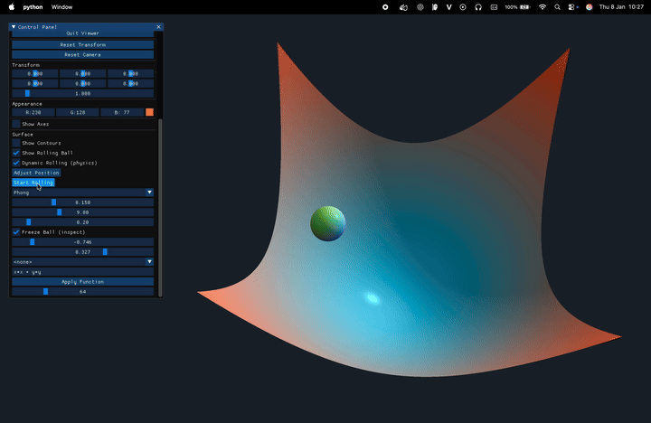

# simpleviewer

Simple OpenGL-based viewer utilities and demo scenes.

## Demo



---

# download requirement

python -m pip install -r requirements.txt

## Run - View object app

From the project root:

- Basic entry point:
  - python -m simpleviewer
- Full viewer with UI:
  - python simpleviewer/viewer_app.py

## Data Generation - ASS 2

From the project root:

```
python -m simpleviewer.data_gen.generate_dataset \
  --config simpleviewer/data_gen/configs/base.json \
  --count 10 \
  --output simpleviewer/data_gen/output \
  --width 512 \
  --height 512
```

Or from inside the `simpleviewer/` folder:

```
PYTHONPATH=.. python -m simpleviewer.data_gen.generate_dataset \
  --config data_gen/configs/base.json \
  --count 10 \
  --output data_gen/output \
  --width 512 \
  --height 512
```

Outputs are written under `simpleviewer/data_gen/output/` (from repo root) or `data_gen/output/` (from inside `simpleviewer/`).

## Project Layout

- viewer_app.py: main application with UI
- rendering.py: rendering helpers
- libs/: math/transform/shader utilities
- shaders/: GLSL shaders
- twoD/, threeD/: example scenes
- data_gen/: data generators
